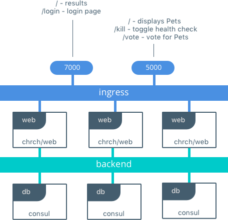
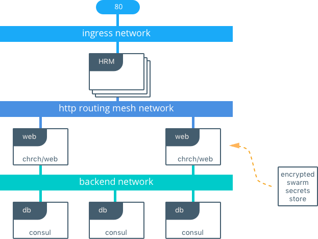

# Docker Pets with Giphy
> written for `jowings/docker-pets:0.1`

original demo found at https://github.com/mark-church/docker-pets/


This is a fork to practice changing app.py (the python code) and roll the changes to the docker stack with Swarm

Docker-Pets-Giphy is comprised of two images:

- `jowings/docker-pets-giphy` is a front-end Python Flask container that serves up random images of housepets, depending on the given configuration using
- `consul` is a back-end KV store that stores the number of visits that the `web` services recieve. It's configured to bootstrap itself with 3 replicas so that we have fault tolerant persistence.

## Building Pets-Giphy from Scratch
This demo is hosted on the Docker Hub at `jowings/docker-pets-giphy:latest` but you can also build it locally with the following steps

```
$ git clone https://github.com/2vcps/docker-pets-giphy
$ cd docker-pets/web
$ docker build -t docker-pets .
```


## Running Pets as a Single Container, Stateless App
```
$ docker run -it -p 5000:5000 docker-pets
```


## Running Pets on Docker for Mac/Windows in Development
Docker Swarm can easily be set up to run applications on a single developer laptop. The full app can be brought up to run in the same way it would run in production. We use a compose v3 file to deploy a fully fault tolerant frontend and backend, along with the configurations, secrets, and networks required for the application to run.
pets
This is the full architecture that is deployed when using [pets-dev-compose.yml](https://github.com/mark-church/docker-pets/blob/master/pets-dev-compose.yml).

```
$ git clone https://github.com/2vcps/docker-pets-giphy

~/docker-pets$  docker -v
Docker version 17.03.1-ce, build c6d412e

docker-pets-giphy jowings$ docker node ls
ID                           HOSTNAME  STATUS  AVAILABILITY  MANAGER STATUS
b0bz8qaotyuajv0d9pjzq38a4 *  moby      Ready   Active        Leader

~/docker-pets-giphy$ docker stack deploy -c pets-dev-compose.yml pets
```




## Pets configuration parameters
The `web` container has several configuration parameters as environment variables:


- **`DB`**: Tells `web` where to find `db`. Service name or `<ip>:<port>`.
- **`DEBUG`**: Puts `web` containers in to debug mode. When mounting a volume for code, they will restart automatically when they detect a change in the code. Defaults to off, set to `True` to turn on.
- **`ADMIN_PASSWORD_FILE`**: Turns secrets on. If set, will password protect the Admin Console of `web`. Set to the full location of the Swarm secret (`/run/secrets/< X >`)

## Exposed Services
- Client Web Access - (dev port `5000`, prod URL `pets.dckr.org`)
	- `/` shows the selected Pet
	- `/vote` displays the vote selection
	- `/health` displays the application health of the given container
	- `/kill` toggles the health off for one of the web servers
- Admin Console - (dev port `7000`, prod URL `admin.pets.dckr.org`)
	- `/` displays voting results, redirects to `/login` if secrets are configured
	- `/login` requests login password
- Consul Backend - (dev port `8500`, prod ephemeral port)
	- `/ui` displays Consul server UI

## Voting Option Configuration

- **`OPTION_A`**: Defaults to 'Cats'. Giphy search for 'cats' return random
- **`OPTION_B`**: Defaults to 'Dogs'. Giphy search for 'dogs' return random
- **`OPTION_C`**: Defaults to 'Whales'. Giphy search for 'whales' return random


This is the full architecture that is deployed when using [pets-prod-compose.yml](https://github.com/2vcps/docker-pets-giphy/blob/master/pets-prod-compose.yml).

```
$ echo "mysecret" | docker secret create admin_password_v1 -
$ docker stack deploy -c pets-prod-compose.yml pets
```


